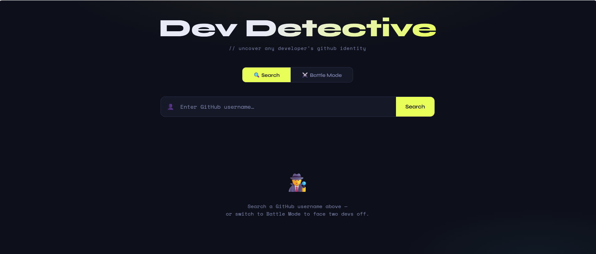
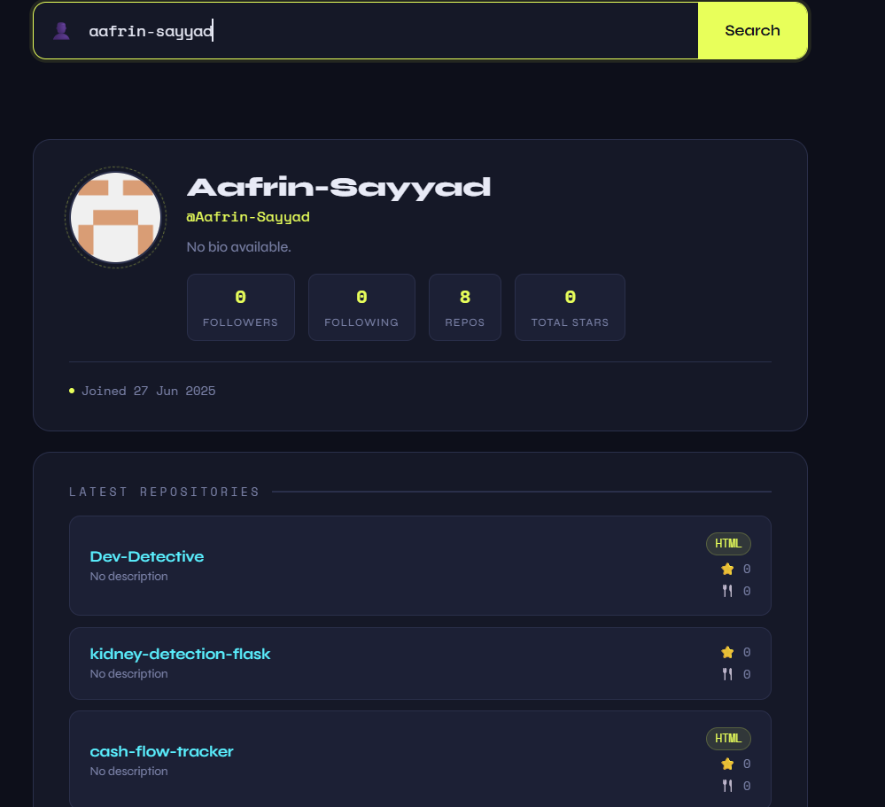
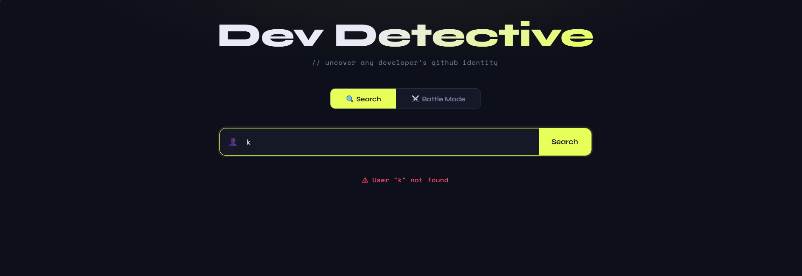
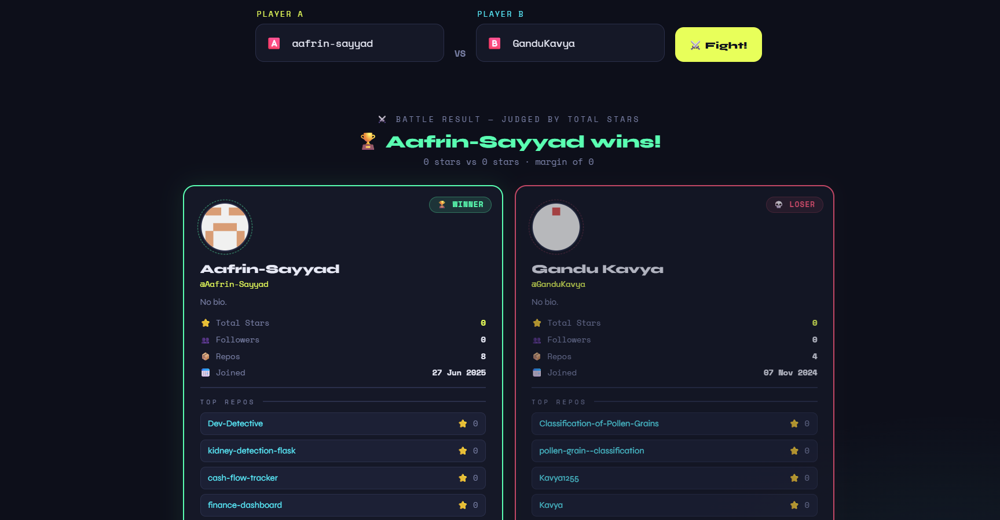

# 🔍 Dev Detective - GitHub User Search App

🌐 **Live Demo:** [https://dev-detective-level3.netlify.app/]

## 🚀 Project Overview
Dev Detective is a web application that allows users to search for GitHub profiles and view detailed information using the GitHub API.

This project was built as part of the Prodesk IT Internship (Week 3 - API Integration Phase).

---

## ✨ Features

### ✅ Level 1 Features
- Search any GitHub username
- Display:
  - Avatar
  - Name
  - Bio
  - Join Date
  - Portfolio URL
- Loading state while fetching data
- Error handling ("User Not Found")

---

### 🚀 Level 2 Features
- Fetch user repositories
- Display Top 5 latest repositories
- Format date into human-readable format
- Clickable repository links (open in new tab)

---

### 🔥 Level 3 Features (Advanced)
- Battle Mode (Compare 2 users)
- Compare based on:
  - Followers OR Total Stars
- Highlight:
  - Winner → Green
  - Loser → Red

---

## 🛠️ Tech Stack
- HTML
- CSS
- JavaScript (Fetch API, Async/Await)
- GitHub REST API

---

## 📡 API Used
- https://api.github.com/users/{username}

---

## ⚙️ How It Works
1. User enters GitHub username
2. App fetches data using Fetch API
3. Displays profile info
4. Fetches repositories
5. Displays top repositories
6. Handles errors and loading states

---
## ⚔️ Battle Mode

Battle Mode is an advanced feature that allows users to compare two GitHub profiles.

### 🔍 How It Works
- User enters two GitHub usernames
- The app fetches data for both users simultaneously using the GitHub API
- It compares them based on:
  - Followers count OR
  - Total stars (calculated from repositories)

### 🧠 Logic Used
- Fetch both users' data using `Promise.all()`
- Fetch repositories for each user
- Loop through repositories and calculate total stars using `stargazers_count`
- Compare both values to determine the winner

### 🏆 Result
- The user with higher score is marked as:
  - 🟢 Winner (highlighted in green)
- The other user is marked as:
  - 🔴 Loser (highlighted in red)

### 💡 Example
If:
- User A → 120 followers  
- User B → 95 followers  

👉 User A is declared the winner

---

This feature demonstrates real-world problem solving using:
- Async/Await
- API handling
- Array iteration
- Conditional rendering

## 📌 Folder Structure
/project
  ├── index.html
  ├── README.md
  └── Prompts.md

---

## 💡 Learnings
- Working with APIs
- Async/Await handling
- Error handling in JavaScript
- DOM manipulation
- Real-world project structure

---

## 🙌 Acknowledgment
This project was completed as part of the Prodesk IT Internship Program.

---
## 📸 Screenshots

### 🏠 Home Page

### 🔍 Search Result

### ❌ Error State

### ⚔️ Battle Mode

## 📬 Author
Sayyad Aafrin 
